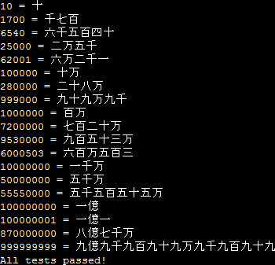

# SuuKotoba
A small library that converts (Arabic) numerals into Japanese kanji. Ex. 91,800 -> 九万一千八百

# Usage
There are three static method signatures that can be used:
`String numToWord(String num)`,
`String numToWord(Integer num)`, and
`String numToWord(BigInteger num)`

Example:
`SuuKotoba.numToWord("2486954371891")` returns "二兆四千八百六十九億五千四百三十七万一千八百九十一"
